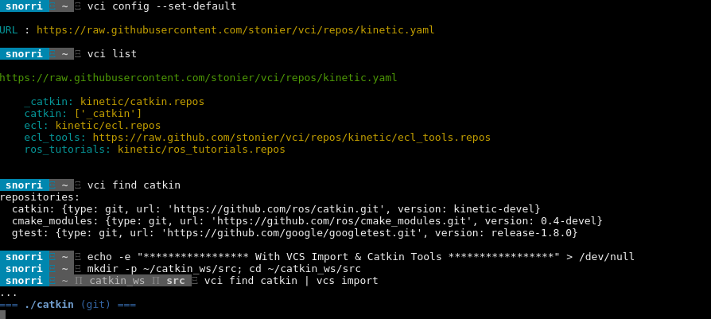

# VCI

Works with [vcstool](https://github.com/dirk-thomas/vcstool) to find/fetch from a `.repos` index.
This is a great way of collecting the locations of all the `.repos`
you use, from both your projects and others, without having to remember
long and forgettable url's.

## Quick Demo

Click to follow the link to a video.

[](http://showterm.io/c5f1a2f5ab8f6f9d5f149#fast)

## Install

Install from either pypi (`pip install vci`) or from
[ppa](https://launchpad.net/~d-stonier/+archive/ubuntu/snorriheim) for xenial.

## Subcommands

```
$ vci --help
usage: vci [-h] [-v] {find,config,list} ...

version control index handling

optional arguments:
  -h, --help          show this help message and exit
  -v, --version       show program's version number and exit

commands:
  {find,config,list}  valid commands for vci interactions
    find              search and retrieve from the version control index
    config            manage the version control index list
    list              display each key, url in the current index

And his noodly appendage reached forth to tickle the blessed...
```

## Listing the Index

The default index contains a few ROS 1 kinetic repositories that
are useful for illustrating this tool:

```bash

$ vci list

https://raw.githubusercontent.com/stonier/vci/repos/kinetic.yaml

    _catkin: kinetic/catkin.repos
    catkin: ['_catkin']
    ecl: kinetic/ecl.repos
    ecl_tools: https://raw.github.com/stonier/vci/repos/kinetic/ecl_tools.repos
    ros_tutorials: ['_catkin', 'kinetic/ros_tutorials.repos']
```

Here you can see there is a convention applied via leading underscores
to indicate keys that should not be used directly, and a mechanism for
composing new keys from a list of other keys. Paths can be absolute or relative.
The [index yaml](https://raw.githubusercontent.com/stonier/vci/repos/kinetic.yaml)
includes considerably more detail and examples in the comments that elucidate the
contents of an index file.

## Switching the Index

You can use an index served from any file publicly served **online**. The most common use
case being a file served from github, but an ordinary file server will also do.

Example, point `vci` at the pre-prepared ros2 index:


```bash
$ vci config https://raw.githubusercontent.com/stonier/vci/repos/ros2.yaml
$ vci list

https://raw.githubusercontent.com/stonier/vci/repos/ros2.yaml

    core: https://raw.githubusercontent.com/ros2/ros2/release-latest/ros2.repos
```

If you need operation **offline** or simply want speedier acess, you can also point
vci at a local index. If offline, this does require that all .repo references
are relative paths.

```bash
# clone vci's repos branch
$ git clone https://github.com/stonier/vci.git /mnt/work/vci
$ cd /mnt/work/vci
$ git checkout repos
$ vci config file:///mnt/work/vci/kinetic.yaml
```

## Import from the Index (w/ VCS)

The `vci find` command can be piped into `vcs import` as follows to import
sources into your workspace:

```bash
$ vci config --set-defaults
$ mkdir ecl_ws; cd ecl_ws
$ vci find ecl | vcs import
```

## Create Your Own Index

For getting started quickly, start your own public repository or branch on
github in the same vein as [vci/repos](https://github.com/stonier/vci/tree/repos).

Refer to [kinetic.yaml](https://github.com/stonier/vci/blob/repos/kinetic.yaml)
for detailed examples and tips on creating your own index yaml file. Once created,
simply point vci at it with the `vci config <url>` command.

# Dev Notes

For testing and development, run in a virtual env wrapper via:

```
source setup.bash
```
